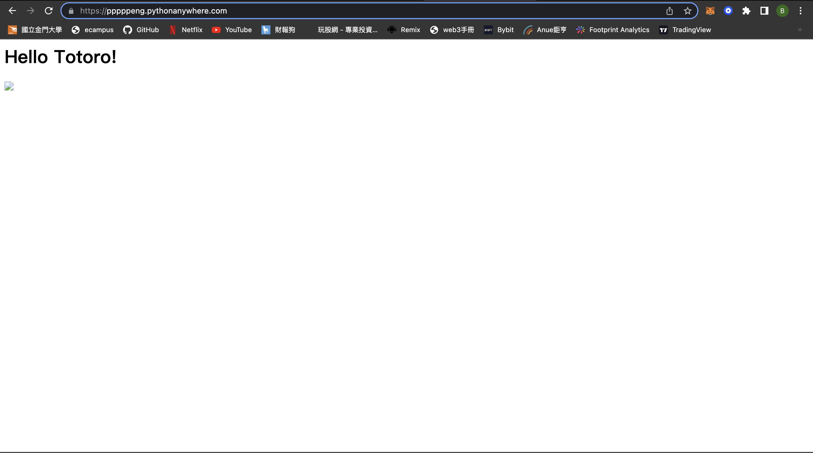
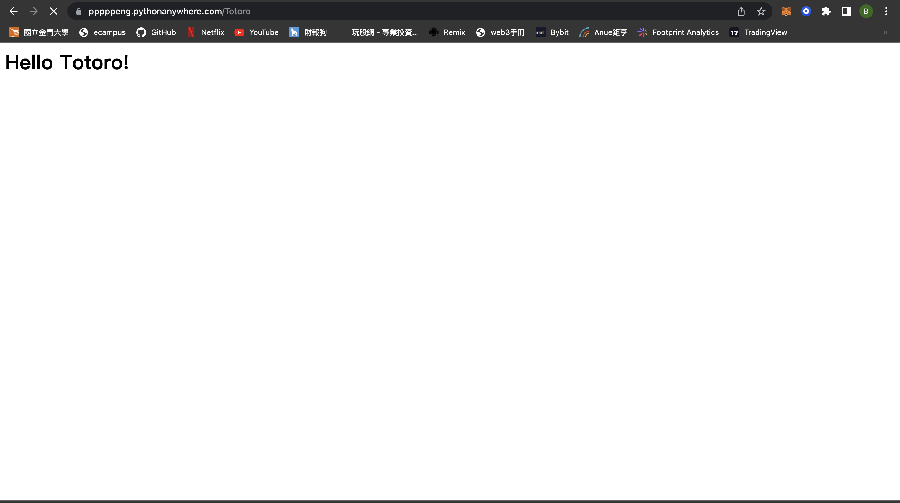

# Final_tern

[pythonanywhere URL](https://pppppeng.pythonanywhere.com/)

## CH0 前言
* 目前它在 GitHub 上是 Star 数量最多的 Python Web 框架，没有之一。
* Flask 是一个使用 Python 语言编写的 Web 框架，它可以让你高效的编写 Web 程序。
* Flask 是典型的微框架，作为 Web 框架来说，它仅保留了核心功能：请求响应处理和模板渲染。

## CH1 Hello, Flask!
 * app.py
 ```python
 from flask import Flask
from flask import escape

app = Flask(__name__)

@app.route('/ppp')
def Rick():
    return "I'm PPP"

@app.route('/Totoro')
@app.route('/')
def Totoro():
    return '<h1>Hello Totoro!</h1>'
@app.route('/user/<name>')
def user_page(name):
    return 'user:%s'%escape(name)

@app.route('/test')
def test_url_for():
    # 下面是一些调用示例（请在命令行窗口查看输出的 URL）：
    print(url_for('ppp'))  # 输出：/rick
    print(url_for('Totoro')) # 输出：/
    # 注意下面两个调用是如何生成包含 URL 变量的 URL 的
    print(url_for('user_page', name='greyli'))  # 输出：/user/greyli
    print(url_for('user_page', name='peter'))  # 输出：/user/peter
    print(url_for('test_url_for'))  # 输出：/test
    # 下面这个调用传入了多余的关键字参数，它们会被作为查询字符串附加到 URL 后面。
    print(url_for('test_url_for', num=2))  # 输出：/test?num=2
    return 'Test page'
 ```
 ### result
 * hello
 

 * home and Totoro
 
 

 * user page
 

 ---

 ## CH2 templates
 * app.py
 ```python
name = 'Grey Li'
movies = [
    {'title': 'My Neighbor Totoro', 'year': '1988'},
    {'title': 'Dead Poets Society', 'year': '1989'},
    {'title': 'A Perfect World', 'year': '1993'},
    {'title': 'Leon', 'year': '1994'},
    {'title': 'Mahjong', 'year': '1996'},
    {'title': 'Swallowtail Butterfly', 'year': '1996'},
    {'title': 'King of Comedy', 'year': '1999'},
    {'title': 'Devils on the Doorstep', 'year': '1999'},
    {'title': 'WALL-E', 'year': '2008'},
    {'title': 'The Pork of Music', 'year': '2012'},
]
 def index():
    return render_template('index.html', name=name, movies=movies)
 ```
 * index.html
 ```html
 <!DOCTYPE html>
<html lang="en">
<head>
    <meta charset="utf-8">
    <title>{{ name }}'s Watchlist</title>
</head>
<body>
    <h2>{{ name }}'s Watchlist</h2>
    {# 使用 length 过滤器获取 movies 变量的长度 #}
    <p>{{ movies|length }} Titles</p>
    <ul>
          {# 迭代 movies 变量 #}
        <li>{{ movie.title }} - {{ movie.year }}</li>  {# 等同于 movie['title'] #}
          {# 使用 endfor 标签结束 for 语句 #}
    </ul>
    <footer>
        <small>&copy; 2018 <a href="http://helloflask.com/tutorial">HelloFlask</a></small>
	</footer>
</body>
</html>
 ```
 ### result


---

## CH3 static
* 添加图片
* 添加 CSS
### result


---

## CH4 数据库
* 选择了属于关系型数据库管理系统（RDBMS）的 SQLite
* 在数据库操作简单、访问量低的程序中使用。
* 为了简化数据库操作，我们将使用 SQLAlchemy——一个 Python 数据库工具（ORM，即对象关系映射）。借助 SQLAlchemy，你可以通过定义 Python 类来表示数据库里的一张表（类属性表示表中的字段 / 列），通过对这个类进行各种操作来代替写 SQL 语句。
模型类的编写有一些限制：

* 模型类要声明继承 `db.Model`。
* 每一个类属性（字段）要实例化 `db.Column`，传入的参数为字段的类型，下面的表格列出了常用的字段类。
* 在 `db.Column()` 中添加额外的选项（参数）可以对字段进行设置。比如，`primary_key` 设置当前字段是否为主键。除此之外，常用的选项还有 `nullable`（布尔值，是否允许为空值）、`index`（布尔值，是否设置索引）、`unique`（布尔值，是否允许重复值）、`default`（设置默认值）等。

常用的字段类型如下表所示：

| 字段类           | 说明                                          |
| ---------------- | --------------------------------------------- |
| db.Integer       | 整型                                          |
| db.String (size) | 字符串，size 为最大长度，比如 `db.String(20)` |
| db.Text          | 长文本                                        |
| db.DateTime      | 时间日期，Python `datetime` 对象              |
| db.Float         | 浮点数                                        |
| db.Boolean       | 布尔值                                        |

模型类创建后，还不能对数据库进行操作，因为我们还没有创建表和数据库文件。下面在 Python Shell 中创建了它们：
```python
(env) $ flask shell
>>> from app import db
>>> db.create_all()
```
如果你改动了模型类，想重新生成表模式，那么需要先使用 `db.drop_all()` 删除表，然后重新创建：

```python
>>> db.drop_all()
>>> db.create_all()
```
现在执行 `flask forge` 命令就会把所有虚拟数据添加到数据库里：

```bash
(env) $ flask forge
```

* app.py
```python
@app.route('/index')
def index():
    user = User.query.first()
    movies = Movie.query.all()
    return render_template('index.html', user=user, movies=movies)
lass User(db.Model):  # 表名将会是 user（自动生成，小写处理）
    id = db.Column(db.Integer, primary_key=True)  # 主键
    name = db.Column(db.String(20))  # 名字

class Movie(db.Model):  # 表名将会是 movie
    id = db.Column(db.Integer, primary_key=True)  # 主键
    title = db.Column(db.String(60))  # 电影标题
    year = db.Column(db.String(4))  # 电影年份


@app.cli.command()
def forge():
    """Generate fake data."""
    db.create_all()
    
    # 全局的两个变量移动到这个函数内
    name = 'Rick Chen'
    movies = [
        {'title': 'My Neighbor Totoro', 'year': '1988'},
        {'title': 'Dead Poets Society', 'year': '1989'},
        {'title': 'A Perfect World', 'year': '1993'},
        {'title': 'Leon', 'year': '1994'},
        {'title': 'Mahjong', 'year': '1996'},
        {'title': 'Swallowtail Butterfly', 'year': '1996'},
        {'title': 'King of Comedy', 'year': '1999'},
        {'title': 'Devils on the Doorstep', 'year': '1999'},
        {'title': 'WALL-E', 'year': '2008'},
        {'title': 'The Pork of Music', 'year': '2012'},
    ]
    
    user = User(name=name)
    db.session.add(user)
    for m in movies:
        movie = Movie(title=m['title'], year=m['year'])
        db.session.add(movie)
    
    db.session.commit()
    click.echo('Done.')

```

---

## CH5 模板优化
* 自定义错误页面
```python
@app.errorhandler(404)  # 传入要处理的错误代码
def page_not_found(e):  # 接受异常对象作为参数
    user = User.query.first()
    return render_template('404.html', user=user), 404  # 返回模板和状态码
```
```html
<!DOCTYPE html>
<html lang="en">
<head>
    <meta charset="utf-8">
    <title>{{ user.name }}'s Watchlist</title>
    <link rel="icon" href="{{ url_for('static', filename='favicon.ico') }}">
    <link rel="stylesheet" href="{{ url_for('static', filename='style.css') }}" type="text/css">
</head>
<body>
    <h2>
        
        {{ user.name }}'s Watchlist
    </h2>
    <ul class="movie-list">
        <li>
            Page Not Found - 404
            <span class="float-right">
                <a href="{{ url_for('index') }}">Go Back</a>
            </span>
        </li>
    </ul>
    <footer>
        <small>&copy; 2018 <a href="http://helloflask.com/tutorial">HelloFlask</a></small>
	</footer>
</body>
</html>
```
* 模板上下文处理函数
```python
@app.context_processor
def inject_user():  # 函数名可以随意修改
    user = User.query.first()
    return dict(user=user)  # 需要返回字典，等同于 return {'user': user}
```
* 使用模板继承组织模板
```html
<!DOCTYPE html>
<html lang="en">
<head>
    
    <meta charset="utf-8">
    <meta name="viewport" content="width=device-width, initial-scale=1.0">
    <title>{{ user.name }}'s Watchlist</title>
    <link rel="stylesheet" href="{{ url_for('static', filename='style.css') }}" type="text/css">
    
</head>
<body>
    <h2>
        
        {{ user.name }}'s Watchlist
    </h2>
    <nav>
        <ul>
            <li><a href="{{ url_for('index') }}">Home</a></li>
        </ul>
    </nav>
    
    <footer>
        <small>&copy; 2018 <a href="http://helloflask.com/tutorial">HelloFlask</a></small>
	</footer>
</body>
</html>
```
* 添加 IMDb 链接
```html



<p>{{ movies|length }} Titles</p>
<ul class="movie-list">
    
    <li>{{ movie.title }} - {{ movie.year }}
        <span class="float-right">
            <a class="imdb" href="https://www.imdb.com/find?q={{ movie.title }}" target="_blank" title="Find this movie on IMDb">IMDb</a>
        </span>
    </li>
    
</ul>


```
### result


---

## CH6 表单
### 创建新条目
* 处理表单数据
* 请求对象
* flash 消息
* 重定向响应
### 编辑条目
### 删除条目
### result


---

## CH7 用户认证
### 安全存储密码
* werkzeug.security.check_password_hash()
```python
>>> from werkzeug.security import generate_password_hash, check_password_hash
>>> pw_hash = generate_password_hash('dog')  # 为密码 dog 生成密码散列值
>>> pw_hash  # 查看密码散列值
'pbkdf2:sha256:50000$mm9UPTRI$ee68ebc71434a4405a28d34ae3f170757fb424663dc0ca15198cb881edc0978f'
>>> check_password_hash(pw_hash, 'dog')  # 检查散列值是否对应密码 dog
True
>>> check_password_hash(pw_hash, 'cat')  # 检查散列值是否对应密码 cat
False
```
### 生成管理员账户
* flask admin
```python
import click

@app.cli.command()
@click.option('--username', prompt=True, help='The username used to login.')
@click.option('--password', prompt=True, hide_input=True, confirmation_prompt=True, help='The password used to login.')
def admin(username, password):
    """Create user."""
    db.create_all()

    user = User.query.first()
    if user is not None:
        click.echo('Updating user...')
        user.username = username
        user.set_password(password)  # 设置密码
    else:
        click.echo('Creating user...')
        user = User(username=username, name='Admin')
        user.set_password(password)  # 设置密码
        db.session.add(user)

    db.session.commit()  # 提交数据库会话
    click.echo('Done.')
```
### 使用 Flask-Login 实现用户认证
```python
from flask_login import login_user

# ...

@app.route('/login', methods=['GET', 'POST'])
def login():
    if request.method == 'POST':
        username = request.form['username']
        password = request.form['password']

        if not username or not password:
            flash('Invalid input.')
            return redirect(url_for('login'))
        
        user = User.query.first()
        # 验证用户名和密码是否一致
        if username == user.username and user.validate_password(password):
            login_user(user)  # 登入用户
            flash('Login success.')
            return redirect(url_for('index'))  # 重定向到主页

        flash('Invalid username or password.')  # 如果验证失败，显示错误消息
        return redirect(url_for('login'))  # 重定向回登录页面
    
    return render_template('login.html')
```
```python 
login_manager = LoginManager(app)  # 实例化扩展类

@login_manager.user_loader
def load_user(user_id):  # 创建用户加载回调函数，接受用户 ID 作为参数
    user = User.query.get(int(user_id))  # 用 ID 作为 User 模型的主键查询对应的用户
    return user  # 返回用户对象

@app.route('/login', methods=['GET', 'POST'])
def login():
    if request.method == 'POST':
        username = request.form['username']
        password = request.form['password']

        if not username or not password:
            flash('Invalid input.')
            return redirect(url_for('login'))
        
        user = User.query.first()
        # 验证用户名和密码是否一致
        if username == user.username and user.validate_password(password):
            login_user(user)  # 登入用户
            flash('Login success.')
            return redirect(url_for('index'))  # 重定向到主页

        flash('Invalid username or password.')  # 如果验证失败，显示错误消息
        return redirect(url_for('login'))  # 重定向回登录页面
    
    return render_template('login.html')

@app.route('/logout')
@login_required  # 用于视图保护，后面会详细介绍
def logout():
    logout_user()  # 登出用户
    flash('Goodbye.')
    return redirect(url_for('index'))  # 重定向回首页

@app.route('/settings', methods=['GET', 'POST'])
@login_required
def settings():
    if request.method == 'POST':
        name = request.form['name']
        
        if not name or len(name) > 20:
            flash('Invalid input.')
            return redirect(url_for('settings'))
        
        current_user.name = name
        # current_user 会返回当前登录用户的数据库记录对象
        # 等同于下面的用法
        # user = User.query.first()
        # user.name = name
        db.session.commit()
        flash('Settings updated.')
        return redirect(url_for('index'))
    
    return render_template('settings.html')
```
### result


---

## 测试
### 单元测试
